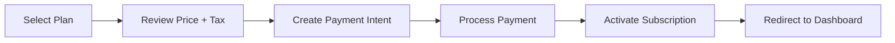

# Welcome to your Lovable project

## Project info

**URL**: https://lovable.dev/projects/469c09f4-177b-4948-a2d3-1ff5c8a6cfea

## How can I edit this code?

There are several ways of editing your application.

**Use Lovable**

Simply visit the [Lovable Project](https://lovable.dev/projects/469c09f4-177b-4948-a2d3-1ff5c8a6cfea) and start prompting.

Changes made via Lovable will be committed automatically to this repo.

**Use your preferred IDE**

If you want to work locally using your own IDE, you can clone this repo and push changes. Pushed changes will also be reflected in Lovable.

The only requirement is having Node.js & npm installed - [install with nvm](https://github.com/nvm-sh/nvm#installing-and-updating)

Follow these steps:

```sh
# Step 1: Clone the repository using the project's Git URL.
git clone <YOUR_GIT_URL>

# Step 2: Navigate to the project directory.
cd <YOUR_PROJECT_NAME>

# Step 3: Install the necessary dependencies.
npm i

# Step 4: Start the development server with auto-reloading and an instant preview.
npm run dev
```

**Edit a file directly in GitHub**

- Navigate to the desired file(s).
- Click the "Edit" button (pencil icon) at the top right of the file view.
- Make your changes and commit the changes.

**Use GitHub Codespaces**

- Navigate to the main page of your repository.
- Click on the "Code" button (green button) near the top right.
- Select the "Codespaces" tab.
- Click on "New codespace" to launch a new Codespace environment.
- Edit files directly within the Codespace and commit and push your changes once you're done.

## What technologies are used for this project?

This project is built with:

- Vite
- TypeScript
- React
- shadcn-ui
- Tailwind CSS

## How can I deploy this project?

Simply open [Lovable](https://lovable.dev/projects/469c09f4-177b-4948-a2d3-1ff5c8a6cfea) and click on Share -> Publish.

## Can I connect a custom domain to my Lovable project?

Yes, you can!

To connect a domain, navigate to Project > Settings > Domains and click Connect Domain.

Read more here: [Setting up a custom domain](https://docs.lovable.dev/features/custom-domain#custom-domain)


# InvoicePro - Multi-Tenant SaaS Invoice Management System

A comprehensive, enterprise-grade invoicing platform with Super Admin Portal, supporting multiple regions, currencies, languages, and tax systems.

## 🌍 Regional Support

### Currently Supported
- **India (IN)**: INR currency, Hindi language, GST tax system (18%)
- **Saudi Arabia (SA)**: SAR currency, Arabic language (RTL), VAT tax system (15%)
- **United States (US)**: USD currency, English language, configurable sales tax

### Future-Ready Architecture
The system is built with extensibility in mind. Adding new countries/regions requires:
1. Add translation file in `src/i18n/locales/{locale}.json`
2. Add region config in `src/contexts/LocaleContext.tsx`
3. Update tax calculation logic in `src/lib/utils/tax.ts`
4. Backend: Add tax rules in payment service

## 🚀 Features

### For End Users
- ✅ Multi-language invoicing (English, Arabic, Hindi)
- ✅ Multi-currency support (USD, SAR, INR)
- ✅ Automatic tax calculation (GST for India, VAT for Saudi)
- ✅ Client management
- ✅ Product/Service catalog
- ✅ Invoice generation with PDF export
- ✅ Payment tracking
- ✅ Analytics and reports
- ✅ User profiles and settings

### For Super Admins
- ✅ Complete system overview dashboard
- ✅ User management (view, edit roles, suspend, delete)
- ✅ Organization management
- ✅ Subscription plan management (create, edit, delete plans)
- ✅ Advanced analytics with charts
- ✅ System activity logs
- ✅ Global settings configuration
- ✅ Revenue tracking
- ✅ Payment gateway integration

### Payment Integration
- ✅ **Stripe** - Global payment processing (USD, SAR, EUR, GBP)
- ✅ **Razorpay** - India-specific (INR, UPI, cards)
- ✅ Secure payment intent creation
- ✅ Tax-inclusive pricing
- ✅ Subscription management
- ✅ Payment history
- ✅ Invoice generation for payments

## 📁 Project Structure

```
src/
├── components/
│   ├── ui/                    # Shadcn UI components
│   ├── super-admin/           # Super admin specific components
│   ├── Layout.tsx             # Main app layout
│   ├── LanguageSelector.tsx   # Region/language switcher
│   ├── PlanPurchaseDialog.tsx # Payment checkout dialog
│   └── ...
├── contexts/
│   ├── AuthContext.tsx        # Authentication state
│   └── LocaleContext.tsx      # Multi-language/currency/tax config
├── i18n/
│   ├── config.ts              # i18next configuration
│   └── locales/               # Translation files (en, ar, hi)
├── lib/
│   ├── api.ts                 # Axios instance with interceptors
│   ├── utils/
│   │   ├── formatters.ts      # Currency, date, number formatting
│   │   └── tax.ts             # Tax calculation utilities
│   └── validations/           # Zod schemas
├── pages/
│   ├── Landing.tsx            # Public landing page
│   ├── Pricing.tsx            # Public pricing page
│   ├── Login.tsx              # Authentication
│   ├── Dashboard.tsx          # User dashboard
│   ├── Invoices.tsx           # Invoice management
│   └── super-admin/           # Super admin pages
│       ├── Dashboard.tsx
│       ├── Users.tsx
│       ├── Organizations.tsx
│       ├── Plans.tsx
│       ├── Analytics.tsx
│       ├── Logs.tsx
│       └── Settings.tsx
├── services/
│   ├── authService.ts         # Authentication API
│   ├── superAdminService.ts   # Super admin operations
│   ├── invoiceService.ts      # Invoice CRUD
│   ├── clientService.ts       # Client management
│   └── paymentService.ts      # Payment gateway integration
└── types/                     # TypeScript interfaces

## 🛠 Technology Stack

### Frontend
- **React 18** - UI framework
- **TypeScript** - Type safety
- **Vite** - Build tool
- **TanStack Query** - Server state management
- **React Router** - Routing
- **Tailwind CSS** - Styling
- **Shadcn/ui** - UI components
- **i18next** - Internationalization
- **React Hook Form + Zod** - Form validation
- **Recharts** - Analytics charts
- **date-fns** - Date formatting

### Backend (Node.js - Separate Repository)
See [BACKEND_API_DOCUMENTATION.md](./BACKEND_API_DOCUMENTATION.md) for complete backend implementation.

- **Node.js + Express** - Server framework
- **PostgreSQL** - Database
- **Prisma ORM** - Database management
- **JWT** - Authentication
- **Bcrypt** - Password hashing
- **Stripe SDK** - Global payments
- **Razorpay SDK** - India payments

## 🔐 Security Features

### Role-Based Access Control (RBAC)
```typescript
// Roles stored in separate table (NOT in users table)
enum UserRole {
  USER        // Regular user
  ADMIN       // Organization admin
  SUPER_ADMIN // Platform super admin
}
```

### Security Measures
- ✅ JWT-based authentication with HTTP-only cookies
- ✅ Password hashing with bcrypt (10 rounds)
- ✅ Role verification on every API request
- ✅ Separate `user_roles` table (prevents privilege escalation)
- ✅ Audit logging for all super admin actions
- ✅ Rate limiting (100 req/15min for users, 200 for admins)
- ✅ Input validation with Zod schemas
- ✅ SQL injection protection via Prisma ORM
- ✅ XSS protection
- ✅ CORS configuration
- ✅ Secure payment intent creation
- ✅ Webhook signature verification

## 💳 Tax Systems

### India (GST - Goods and Services Tax)
```typescript
// Intra-state (same state)
CGST = 9% (Central GST)
SGST = 9% (State GST)
Total GST = 18%

// Inter-state (different states)
IGST = 18% (Integrated GST)
```

### Saudi Arabia (VAT)
```typescript
VAT = 15%
Total = Subtotal + VAT
```

### Tax Calculation API
```typescript
import { calculateIndiaGST, calculateSaudiVAT } from '@/lib/utils/tax';

// For India
const breakdown = calculateIndiaGST(1000, 18, false);
// { subtotal: 1000, cgst: 90, sgst: 90, total: 1180 }

// For Saudi Arabia
const breakdown = calculateSaudiVAT(1000, 15);
// { subtotal: 1000, vat: 150, total: 1150 }
```

## 🌐 Internationalization (i18n)

### Supported Languages
- **English (en)** - Default, LTR
- **Arabic (ar)** - RTL support, Saudi Arabia
- **Hindi (hi)** - LTR, India

### Adding New Languages
1. Create translation file:
```json
// src/i18n/locales/fr.json
{
  "common": { "save": "Enregistrer" },
  "dashboard": { "title": "Tableau de bord" }
}
```

2. Update i18n config:
```typescript
// src/i18n/config.ts
import frTranslations from './locales/fr.json';

resources: {
  fr: { translation: frTranslations }
}
```

3. Add to LocaleContext:
```typescript
export type SupportedLanguage = 'en' | 'ar' | 'hi' | 'fr';
```

### Usage in Components
```typescript
import { useTranslation } from 'react-i18next';

const { t } = useTranslation();
<h1>{t('dashboard.title')}</h1>
```

## 💰 Payment Gateway Integration

### Pricing Page
Public page where users can browse and purchase subscription plans:
- `/pricing` - View all active plans
- Real-time currency conversion
- Tax calculation preview
- Secure checkout with PlanPurchaseDialog

### Payment Flow


### Supported Gateways
| Region | Gateway | Currencies | Methods |
|--------|---------|------------|---------|
| India | Razorpay | INR | Cards, UPI, Wallets |
| Saudi Arabia | Stripe, Moyasar | SAR | Cards |
| Global | Stripe | USD, EUR, GBP | Cards |

## 🚀 Getting Started

### Installation
```bash
# Clone repository
git clone <YOUR_GIT_URL>
cd <YOUR_PROJECT_NAME>

# Install dependencies
npm install

# Start development server
npm run dev
```

### Environment Setup
Create `.env.local` (frontend):
```env
VITE_API_URL=http://localhost:3000
```

## 📚 API Documentation

Complete backend API documentation with all endpoints, request/response examples, database schema, and implementation guides: 

👉 **[BACKEND_API_DOCUMENTATION.md](./BACKEND_API_DOCUMENTATION.md)**

### Key Endpoints
- `POST /api/auth/login` - Authentication
- `GET /api/super-admin/analytics` - System stats
- `GET /api/super-admin/users` - User management
- `POST /api/payments/create-intent` - Payment processing
- `POST /api/invoices` - Create invoice with auto tax calculation

## 🎨 Design System

### Color Palette
The system uses semantic color tokens defined in `tailwind.config.ts`:
- `primary` - Brand color
- `secondary` - Accent color
- `muted` - Subtle backgrounds
- `accent` - Interactive elements
- `destructive` - Error states

### Currency Formatting
```typescript
import { useLocale } from '@/contexts/LocaleContext';

const { formatCurrency } = useLocale();
formatCurrency(1000) // "$1,000.00" or "₹1,000.00" or "﷼1,000.00"
```

## 📊 Analytics & Reporting

Super Admin Dashboard includes:
- Total users, organizations, revenue
- Monthly active users
- Revenue charts (line/area charts)
- Plan distribution (pie chart)
- User growth trends
- Invoice volume tracking
- Export to CSV/Excel/PDF

## 🔄 Data Flow

### Authentication
```
Login → JWT Token → LocalStorage → API Headers → Protected Routes
```

### Multi-tenancy
```
User → Organization → Subscription Plan → Features → Invoices
```

### Invoice Creation
```
Select Client → Add Items → Auto-calculate Tax → Generate PDF → Track Payment
```

## 🧪 Testing Checklist

- [ ] Login as super admin (role: SUPER_ADMIN)
- [ ] Login as regular user (role: USER)
- [ ] Access denied for users trying super admin routes
- [ ] Change language/region (UI updates, RTL for Arabic)
- [ ] Create invoice with tax calculation
- [ ] Purchase subscription plan
- [ ] Export data from analytics
- [ ] View system logs
- [ ] Mobile responsive (all pages)

## 📦 Deployment

### Frontend (Lovable)
Simply click **Publish** in Lovable dashboard.

### Backend (Node.js)
```bash
# Install dependencies
npm install

# Run Prisma migrations
npx prisma migrate deploy

# Build
npm run build

# Start production server
npm start
```

Deploy to: Vercel, Railway, Render, AWS, or your preferred platform.

## 🔮 Future Enhancements

### Planned Features
- [ ] Email notifications (invoice sent, payment received)
- [ ] Recurring invoices
- [ ] Multi-currency invoices
- [ ] Custom invoice templates
- [ ] Client portal (view/pay invoices)
- [ ] Mobile app (React Native)
- [ ] Inventory management
- [ ] Time tracking
- [ ] Expense management
- [ ] More payment gateways (PayPal, Square)

### Additional Regions
- [ ] European Union (EUR, multiple languages)
- [ ] United Arab Emirates (AED, Arabic)
- [ ] Canada (CAD, English/French)
- [ ] Australia (AUD, English)

## 📄 License

This project is private and proprietary.

## 🤝 Support

For backend implementation questions, refer to [BACKEND_API_DOCUMENTATION.md](./BACKEND_API_DOCUMENTATION.md).

---

**Built with ❤️ using Lovable.dev**
